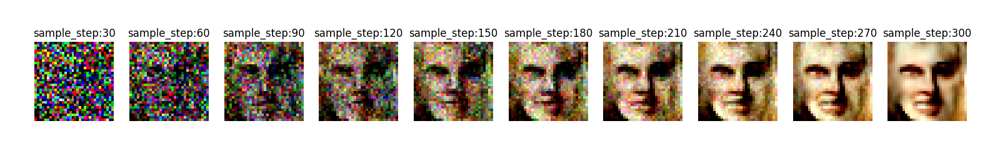

# Simpliest-DDIM-implemtation
# train
Use train.py to train, put your train dataset in the dataset folder
# predict
For lazy people, I already upload the pre-trained model, just RUN THE predict.py
# result

